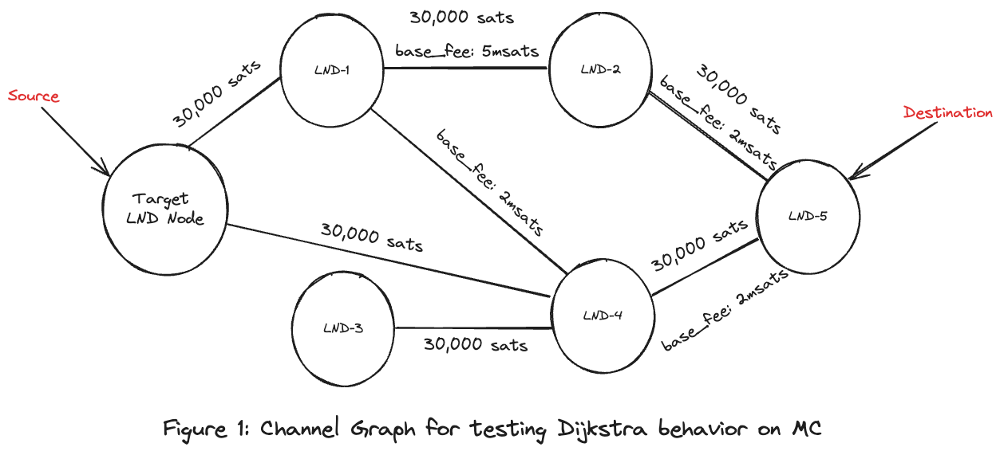
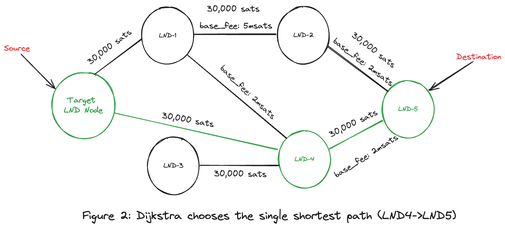
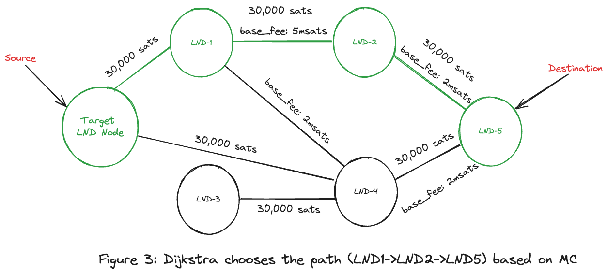

# Impact of Mission Control Data on Dijkstra's Algorithm Behavior

## Table of Contents
1. [Introduction](#introduction)
2. [Metadata](#metadata)
3. [Route](#route)
4. [Prerequisites](#prerequisites)
5. [Channel Graph](#channel-graph)
6. [Dijkstra Behavior Before Importing Mission Control Data from EC](#dijkstra-behavior-before-importing-mission-control-data-from-ec)
   - [Output Behavior Analysis](#output-behavior-analysis)
   - [Payment Details](#payment-details)
   - [HTLC State](#htlc-state)
   - [Payment Status](#payment-status)
   - [Mission Control Query](#mission-control-query)
7. [Dijkstra Behavior After External Coordinator (EC) Integration](#dijkstra-behavior-after-external-coordinator-ec-integration)
   - [Output Behavior Analysis](#output-behavior-analysis-1)
   - [Mission Control Query](#mission-control-query-1)
   - [Payment Details](#payment-details-1)
   - [HTLC State](#htlc-state-1)
   - [Payment Status](#payment-status-1)
8. [Conclusion](#conclusion)

## Introduction
This document examines the behavior of Dijkstra's algorithm before and after
integrating mission control data within a Lightning Network Daemon (LND)
environment. It highlights how the algorithm's pathfinding changes based on the
availability of mission control data.

## Metadata
| **Node**            | **Public Key**                                                     |
|---------------------|--------------------------------------------------------------------|
| **Target LND Node** | 035b5f578e13455f2f6243fa4b02fcd324b2892f25a540e41e22c17c040c9046f6 |
| **LND1**            | 02241b3445034962ce19e2ee0e776c9495a48c96d23b7786cf756f66474becaa4a |
| **LND2**            | 03b86936fc314c88db808a3d48c74ccaa986c87ab1a178c8ee849a4b0ddbe76a4a |
| **LND3**            | 038c36cdd2cc8204df76d6fc7566d2692f262323ea79583123ffd0470fd571511f |
| **LND4**            | 03b2b50b3dbbf52e17a427050195197a054892b25f693481116965f0e42a88a3c7 |
| **LND5**            | 02d72247d59d0cf3c0f7459aa3e275de0683b273943191fa14a5d4201039ad4f62 |

## Route
- **Source**: `Target LND Node`
- **Destination**: `LND5`

## Prerequisites
- Mission control data is reset before making these payments to ensure the
experiment's independence using `ResetMissionControl RPC`.
- For the second experiment, mission control data is imported from External
Coordinator (EC) for the route (`LND1 -> LND2 -> LND5`) into the
`Target LND Node` before making the payment.

## Channel Graph



## Dijkstra Behavior Before Importing Mission Control Data from EC

### Output Behavior Analysis
- Dijkstra's algorithm utilizes channel graph data to determine the single
shortest path based on available capacity, number of intermediary hops, and
weighted edges (base fee rates). 
- **Chosen Route**: (`Target LND Node -> LND4 -> LND5`) with one intermediary hop
and base_fee of 2msats.
- HTLC attempt uses the route (`LND4 -> LND5`).



### Payment Details
```bash
root@lnd# lncli -network=regtest payinvoice lnbcrt50u1pn9urtrpp5hkg3y8g065x7zd06mkm2a3twmmghfm0mczt2y5amkrjstc5xel3qdqqcqzzsxqyz5vqsp5n0p53y52q59sqs5m3mk9c5xgwqlc54vxhgc3rdxqqh0ywkdlp6fs9qxpqysgqcakfumfqv7skg5cjsycvmx45sfvf0jhq4kp2ug026cgkysrgl9d94jety8s7hkfcjz6z5me9ymyn9utux87d79vr39xpw0djrkz0csgpkjcvj3
```

**Payment Hash**: bd91121d0fd50de135faddb6aec56eded174edfbc096a253bbb0e505e286cfe2  
**Amount**: 5000 satoshis  
**Fee Limit**: 250 satoshis  
**Destination**: 02d72247d59d0cf3c0f7459aa3e275de0683b273943191fa14a5d4201039ad4f62  
**Confirm Payment**: yes

### HTLC State
```plaintext
+------------+--------------+--------------+--------------+-------+----------+-----------------+------------+
| HTLC_STATE | ATTEMPT_TIME | RESOLVE_TIME | RECEIVER_AMT | FEE   | TIMELOCK | CHAN_OUT        | ROUTE      |
+------------+--------------+--------------+--------------+-------+----------+-----------------+------------+
| SUCCEEDED  |        0.034 |        0.273 | 5000         | 0.007 |     1072 | 2111062325395456| lnd4->lnd5 |
+------------+--------------+--------------+--------------+-------+----------+-----------------+------------+
```

### Payment Status
- **Status**: SUCCEEDED
- **Preimage**: e6275b3770fc7fcc56478465845e8571a8070b52c0e9b540970734dd59be98a1

### Mission Control Query
```bash
root@lnd# lncli -network=regtest querymc
{
    "pairs": [
        # Target LND Node  -> LND4 (Edge).
        {
            "node_from": "035b5f578e13455f2f6243fa4b02fcd324b2892f25a540e41e22c17c040c9046f6",
            "node_to": "03b2b50b3dbbf52e17a427050195197a054892b25f693481116965f0e42a88a3c7",
            "history": {
                "fail_time": "0",
                "fail_amt_sat": "0",
                "fail_amt_msat": "0",
                "success_time": "1717439913",
                "success_amt_sat": "5000",
                "success_amt_msat": "5000007"
            }
        },
        # LND4  -> LND5 (Target Edge).
        {
            "node_from": "03b2b50b3dbbf52e17a427050195197a054892b25f693481116965f0e42a88a3c7",
            "node_to": "02d72247d59d0cf3c0f7459aa3e275de0683b273943191fa14a5d4201039ad4f62",
            "history": {
                "fail_time": "0",
                "fail_amt_sat": "0",
                "fail_amt_msat": "0",
                "success_time": "1717439913",
                "success_amt_sat": "5000",
                "success_amt_msat": "5000000"
            }
        }
    ]
}
```

## Dijkstra Behavior After Importing Mission Control Data from EC

### Output Behavior Analysis
- The route was chosen based on imported mission control data:
  (`Target LND Node` -> `LND1` -> `LND2` -> `LND5`).
- HTLC attempt uses the route (`LND1 -> LND2 -> LND5`).



### Mission Control Query
```bash
root@lnd# lncli -network=regtest querymc
{
    "pairs": [
        # Target LND Node  -> LND1 (Edge).
        {
            "node_from": "035b5f578e13455f2f6243fa4b02fcd324b2892f25a540e41e22c17c040c9046f6",
            "node_to": "02241b3445034962ce19e2ee0e776c9495a48c96d23b7786cf756f66474becaa4a",
            "history": {
                "fail_time": "0",
                "fail_amt_sat": "0",
                "fail_amt_msat": "0",
                "success_time": "1717445000",
                "success_amt_sat": "5000",
                "success_amt_msat": "5000014"
            }
        },
        # LND1  -> LND2 (Edge).
        {
            "node_from": "02241b3445034962ce19e2ee0e776c9495a48c96d23b7786cf756f66474becaa4a",
            "node_to": "03b86936fc314c88db808a3d48c74ccaa986c87ab1a178c8ee849a4b0ddbe76a4a",
            "history": {
                "fail_time": "0",
                "fail_amt_sat": "0",
                "fail_amt_msat": "0",
                "success_time": "1717445000",
                "success_amt_sat": "5000",
                "success_amt_msat": "5000007"
            }
        },
        # LND2  -> LND5 (Target Edge).
        {
            "node_from": "03b86936fc314c88db808a3d48c74ccaa986c87ab1a178c8ee849a4b0ddbe76a4a",
            "node_to": "02d72247d59d0cf3c0f7459aa3e275de0683b273943191fa14a5d4201039ad4f62",
            "history": {
                "fail_time": "0",
                "fail_amt_sat": "0",
                "fail_amt_msat": "0",
                "success_time": "1717445000",
                "success_amt_sat": "5000",
                "success_amt_msat": "5000000"
            }
        }
    ]
}
```

### Payment Details
```bash
root@lnd# lncli -network=regtest payinvoice lnbcrt50u1pn9u83kpp50mzv82q96yfrp6sdunm27lgwfuaxc3nhhwn84ngr0wsydvncff7qdqqcqzzsxqyz5vqsp5jljmkkwd5uwmnj3cq9797kwyxjc5v2j226gxhp4t429qq0v93kus9qxpqysgqhrtse39ljjtjmv049dqld30xyqd6egf2nf0f867wn59ce78d05vxh33524k23vlrcz6x6cxkx7xzjhmhtxgk4f8vnpx9uh5fxj3ysegpgdg8fj
```

**Payment Hash**: 7ec4c3a805d11230ea0de4f6af7d0e4f3a6c4677bba67acd037ba046b2784a7c  
**Amount**: 5000 satoshis  
**Fee Limit**: 250 satoshis  
**Destination**: 02d72247d59d0cf3c0f7459aa3e275de0683b273943191fa14a5d4201039ad4f62  
**Confirm Payment**: yes

### HTLC State
```plaintext
+------------+--------------+--------------+--------------+-------+----------+-----------------+------------------+
| HTLC_STATE | ATTEMPT_TIME | RESOLVE_TIME | RECEIVER_AMT | FEE   | TIMELOCK | CHAN_OUT        | ROUTE            |
+------------+--------------+--------------+--------------+-------+----------+-----------------+------------------+
| SUCCEEDED  |        0.029 |        0.408 | 5000         | 0.014 |     1455 | 3887873115881472| lnd1->lnd2->lnd5 |
+------------+--------------+--------------+--------------+-------+----------+-----------------+------------------+
```

### Payment Status
- **Status**: SUCCEEDED
- **Preimage**: 2691865f886bfc9f12930739b2674f74aa5526e260500001d02abf3802b91f45

## Conclusion

Integrating mission control data into Dijkstra's algorithm for pathfinding
within the Lightning Network Daemon (LND) environment has a noticeable impact on
the route selection process and the overall efficiency of payments. 

### Key Observations

1. **Path Selection Improvement**:
   - Before importing mission control data, Dijkstra's algorithm selected
   a route based solely on the channel graph data, resulting in a simpler path
   (`Target LND Node -> LND4 -> LND5`) with a minimal fee of 2msats and minimal
   number of 1 intermediary hop.
   - After importing mission control data from the External Coordinator (EC),
   the algorithm opted for a different route
   (`Target LND Node -> LND1 -> LND2 -> LND5`), considering the historical
   success rates and node reliability, which slightly increased the fee to
   7msats with 2 intermediary hops but potentially enhanced the success
   probability of the payment.

2. **HTLC State and Payment Efficiency**:
   - The HTLC state for both attempts indicated a successful payment, but the
   route with mission control data integration showed a more complex path with
   two intermediary hops.
   - The increased number of hops and the higher fee in the second experiment
   suggests that the mission control data can influence the algorithm to choose
   routes that might have a higher success rate even if they are not the most
   cost-efficient.

3. **Mission Control Data Influence**:
   - The mission control data provided additional context to the algorithm,
   allowing it to avoid potentially unreliable nodes and channels, thus
   improving the robustness of the payment process.
   - The success history embedded in the mission control data helped in making
   informed decisions about the route, which was not possible with the basic
   channel graph data alone.

### Implications

The results demonstrate that incorporating mission control data can
significantly enhance the decision-making process of Dijkstra's algorithm by
leveraging historical payment success and failure information.
This leads to more informed and reliable path selections, albeit sometimes at
the cost of increased fees. Therefore, the integration of mission control data
is highly beneficial for optimizing payment routes in the Lightning Network,
ensuring a higher likelihood of transaction success, especially in complex
network environments.
