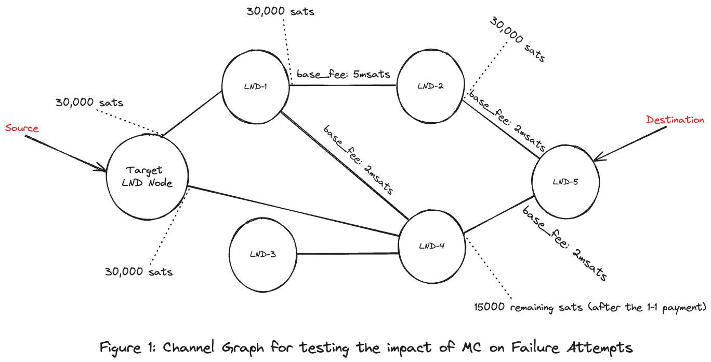
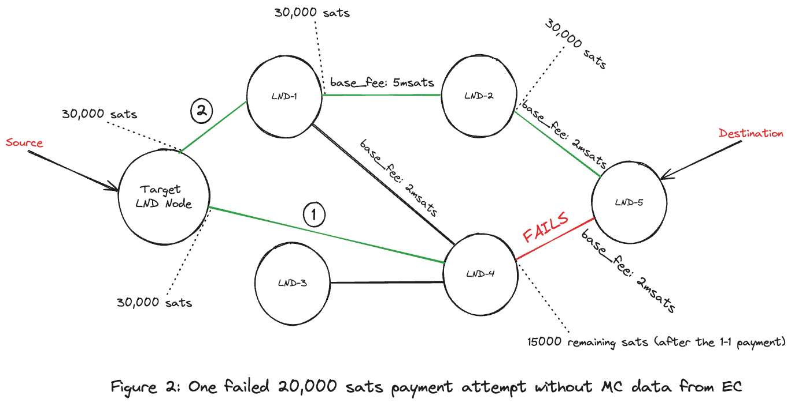
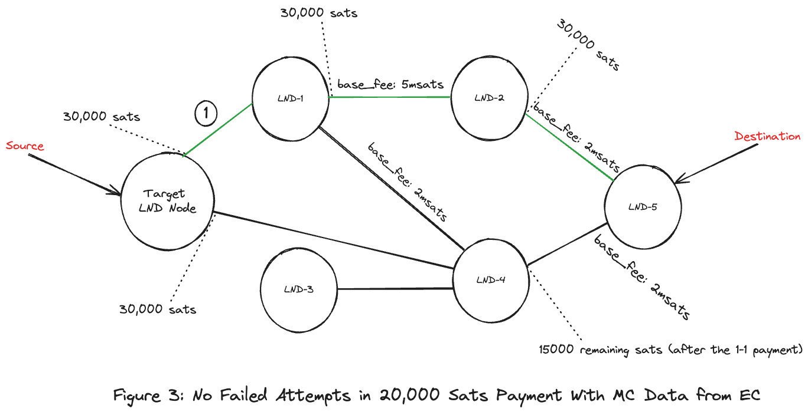

# Impact of Mission Control Data on Failure Attempts

## Table of Contents
1. [Introduction](#introduction)
2. [Metadata](#metadata)
3. [Route](#route)
4. [Prerequisites](#prerequisites)
5. [Channel Graph](#channel-graph)
6. [Failure Attempts Before External Coordinator (EC) Integration](#failure-attempts-before-external-coordinator-ec-integration)
   - [Output Behavior Analysis](#output-behavior-analysis-before)
   - [Payment Details](#payment-details-before)
   - [HTLC State](#htlc-state-before)
   - [Payment Status](#payment-status-before)
   - [Mission Control Query](#mission-control-query-before)
7. [Failure Attempts After External Coordinator (EC) Integration](#failure-attempts-after-external-coordinator-ec-integration)
   - [Output Behavior Analysis](#output-behavior-analysis-after)
   - [Mission Control Query](#mission-control-query-after)
   - [Payment Details](#payment-details-after)
   - [HTLC State](#htlc-state-after)
   - [Payment Status](#payment-status-after)
8. [Conclusion](#conclusion)

## Introduction
This document examines the failure attempts in payment routing before and after
integrating mission control data within a Lightning Network Daemon (LND)
environment. It highlights how the mission control data influences the
efficiency of payment attempts and failure rates.

## Metadata
| **Node**            | **Public Key**                                                     |
|---------------------|--------------------------------------------------------------------|
| **Target LND Node** | 035b5f578e13455f2f6243fa4b02fcd324b2892f25a540e41e22c17c040c9046f6 |
| **LND1**            | 02241b3445034962ce19e2ee0e776c9495a48c96d23b7786cf756f66474becaa4a |
| **LND2**            | 03b86936fc314c88db808a3d48c74ccaa986c87ab1a178c8ee849a4b0ddbe76a4a |
| **LND3**            | 038c36cdd2cc8204df76d6fc7566d2692f262323ea79583123ffd0470fd571511f |
| **LND4**            | 03b2b50b3dbbf52e17a427050195197a054892b25f693481116965f0e42a88a3c7 |
| **LND5**            | 02d72247d59d0cf3c0f7459aa3e275de0683b273943191fa14a5d4201039ad4f62 |

## Route
- **Source**: `Target LND Node`
- **Destination**: `LND5`

## Prerequisites
- Mission control data is reset before making these payments to ensure the
experiment's independence using `ResetMissionControl RPC`.
- For the second experiment, mission control data is imported from the External
Coordinator (EC) into the `Target LND Node` before making the payment.

## Channel Graph



## Failure Attempts Before Importing Mission Control Data from EC

### Output Behavior Analysis
- LND uses Dijkstra Algorithm default behavior, choosing the shortest
path: (`Target LND Node -> LND4 -> LND5`).
- Due to insufficient liquidity on LND4, the payment fails on the second channel
and then chooses the second available shortest path:
(`Target LND Node -> LND1 -> LND2 -> LND5`).
- Increased payment processing time due to failed route attempts:
  - Total time: ~0.7 seconds
  - Failed route processing time: ~0.2 seconds
  - Failure processing time ratio: 28.57%
- The failed route processing time can accumulate significantly, especially with
multiple failed routes.



### Payment Details
```bash
root@lnd# lncli --network=regtest payinvoice --json lnbcrt200u1pn9un39pp5gxghsn2phn8swy0kw22gu5jjd24egkc2xphkf0zagju2uk0qpf7qdqqcqzzsxqyz5vqsp5dw4vu7hceuemcsp3kf9hm7ng0f6aj4lnza3fw9zmy6xc6yz9xdfs9qxpqysgqzry6m4s5fjw4s7sy5sg4zs27q634ttpswsp2379995dpqctehjuje8vlxnwkctpq0w6tk8pyp0duqyzwyr57z6r6tttatmwhzhrt4acqgtz5gt
```

**Payment Hash**: 4191784d41bccf0711f672948e52526aab945b0a306f64bc5d44b8ae59e00a7c  
**Amount**: 20000 satoshis  
**Fee Limit**: 1000 satoshis  
**Destination**: 02d72247d59d0cf3c0f7459aa3e275de0683b273943191fa14a5d4201039ad4f62  
**Confirm Payment**: yes

### HTLC State
```bash
{
    "payment_hash": "4191784d41bccf0711f672948e52526aab945b0a306f64bc5d44b8ae59e00a7c",
    "value": "20000",
    "creation_date": "1717456440",
    "fee": "0",
    "payment_preimage": "0bc0377b42141e6612f83eb2730df7287ea33e280af5f9704a6e9ac1da66e2a2",
    "value_sat": "20000",
    "value_msat": "20000000",
    "payment_request": "lnbcrt200u1pn9un39pp5gxghsn2phn8swy0kw22gu5jjd24egkc2xphkf0zagju2uk0qpf7qdqqcqzzsxqyz5vqsp5dw4vu7hceuemcsp3kf9hm7ng0f6aj4lnza3fw9zmy6xc6yz9xdfs9qxpqysgqzry6m4s5fjw4s7sy5sg4zs27q634ttpswsp2379995dpqctehjuje8vlxnwkctpq0w6tk8pyp0duqyzwyr57z6r6tttatmwhzhrt4acqgtz5gt",
    "status": "SUCCEEDED",
    "fee_sat": "0",
    "fee_msat": "47",
    "creation_time_ns": "1717456440398031594",
    "htlcs": [
        # LND 4 -> LND 5 (Failed Route Attempt - 1st try).
        {
            "attempt_id": "10",
            "status": "FAILED",
            "route": {
                "total_time_lock": 2789,
                "total_fees": "0",
                "total_amt": "20000",
                "hops": [
                    {
                        "chan_id": "2111062325395456",
                        "chan_capacity": "30000",
                        "amt_to_forward": "20000",
                        "fee": "0",
                        "expiry": 2709,
                        "amt_to_forward_msat": "20000000",
                        "fee_msat": "22",
                        "pub_key": "03b2b50b3dbbf52e17a427050195197a054892b25f693481116965f0e42a88a3c7",
                        "tlv_payload": true,
                        "mpp_record": null,
                        "amp_record": null,
                        "custom_records": {},
                        "metadata": "",
                        "blinding_point": "",
                        "encrypted_data": "",
                        "total_amt_msat": "0"
                    },
                    {
                        "chan_id": "2666315697422336",
                        "chan_capacity": "30000",
                        "amt_to_forward": "20000",
                        "fee": "0",
                        "expiry": 2709,
                        "amt_to_forward_msat": "20000000",
                        "fee_msat": "0",
                        "pub_key": "02d72247d59d0cf3c0f7459aa3e275de0683b273943191fa14a5d4201039ad4f62",
                        "tlv_payload": true,
                        "mpp_record": {
                            "payment_addr": "6baace7af8cf33bc4031b24b7dfa687a75d957f3176297145b268d8d10453353",
                            "total_amt_msat": "20000000"
                        },
                        "amp_record": null,
                        "custom_records": {},
                        "metadata": "",
                        "blinding_point": "",
                        "encrypted_data": "",
                        "total_amt_msat": "0"
                    }
                ],
                "total_fees_msat": "22",
                "total_amt_msat": "20000022"
            },
            "attempt_time_ns": "1717456440428332677",
            "resolve_time_ns": "1717456440617275927",
            "failure": {
                "code": "TEMPORARY_CHANNEL_FAILURE",
                "channel_update": {
                    "signature": "90c2167afdf809afb591a31d025448162f272be610ca588de0aecd1006517ea010fba9914fc452bef92656766de42901709fa8fa5936aae8e2a2aff3112026c1",
                    "chain_hash": "06226e46111a0b59caaf126043eb5bbf28c34f3a5e332a1fc7b2b73cf188910f",
                    "chan_id": "2666315697422336",
                    "timestamp": 1717456065,
                    "message_flags": 1,
                    "channel_flags": 1,
                    "time_lock_delta": 80,
                    "htlc_minimum_msat": "1000",
                    "base_fee": 2,
                    "fee_rate": 1,
                    "htlc_maximum_msat": "29700000",
                    "extra_opaque_data": ""
                },
                "htlc_msat": "0",
                "onion_sha_256": "",
                "cltv_expiry": 0,
                "flags": 0,
                "failure_source_index": 1,
                "height": 0
            },
            "preimage": ""
        },
        # LND1 -> LND2 -> LND5 (Successful Route Attempt - 2nd try).
        {
            "attempt_id": "11",
            "status": "SUCCEEDED",
            "route": {
                "total_time_lock": 2869,
                "total_fees": "0",
                "total_amt": "20000",
                "hops": [
                    {
                        "chan_id": "2000011650990080",
                        "chan_capacity": "30000",
                        "amt_to_forward": "20000",
                        "fee": "0",
                        "expiry": 2789,
                        "amt_to_forward_msat": "20000022",
                        "fee_msat": "25",
                        "pub_key": "02241b3445034962ce19e2ee0e776c9495a48c96d23b7786cf756f66474becaa4a",
                        "tlv_payload": true,
                        "mpp_record": null,
                        "amp_record": null,
                        "custom_records": {},
                        "metadata": "",
                        "blinding_point": "",
                        "encrypted_data": "",
                        "total_amt_msat": "0"
                    },
                    {
                        "chan_id": "2444214348611584",
                        "chan_capacity": "30000",
                        "amt_to_forward": "20000",
                        "fee": "0",
                        "expiry": 2709,
                        "amt_to_forward_msat": "20000000",
                        "fee_msat": "22",
                        "pub_key": "03b86936fc314c88db808a3d48c74ccaa986c87ab1a178c8ee849a4b0ddbe76a4a",
                        "tlv_payload": true,
                        "mpp_record": null,
                        "amp_record": null,
                        "custom_records": {},
                        "metadata": "",
                        "blinding_point": "",
                        "encrypted_data": "",
                        "total_amt_msat": "0"
                    },
                    {
                        "chan_id": "2777366371827712",
                        "chan_capacity": "30000",
                        "amt_to_forward": "20000",
                        "fee": "0",
                        "expiry": 2709,
                        "amt_to_forward_msat": "20000000",
                        "fee_msat": "0",
                        "pub_key": "02d72247d59d0cf3c0f7459aa3e275de0683b273943191fa14a5d4201039ad4f62",
                        "tlv_payload": true,
                        "mpp_record": {
                            "payment_addr": "6baace7af8cf33bc4031b24b7dfa687a75d957f3176297145b268d8d10453353",
                            "total_amt_msat": "20000000"
                        },
                        "amp_record": null,
                        "custom_records": {},
                        "metadata": "",
                        "blinding_point": "",
                        "encrypted_data": "",
                        "total_amt_msat": "0"
                    }
                ],
                "total_fees_msat": "47",
                "total_amt_msat": "20000047"
            },
            "attempt_time_ns": "1717456440630573177",
            "resolve_time_ns": "1717456441058933719",
            "failure": null,
            "preimage": "0bc0377b42141e6612f83eb2730df7287ea33e280af5f9704a6e9ac1da66e2a2"
        }
    ],
    "payment_index": "24",
    "failure_reason": "FAILURE_REASON_NONE"
}
```

### Payment Status
- **Status**: SUCCEEDED
- **Preimage**: 0bc0377b42141e6612f83eb2730df7287ea33e280af5f9704a6e9ac1da66e2a2

### Mission Control Query
```bash
root@lnd# lncli --network=regtest querymc
{
    "pairs": [
        # Target LND Node -> LND4 (Edge).
        {
            "node_from": "035b5f578e13455f2f6243fa4b02fcd324b2892f25a540e41e22c17c040c9046f6",
            "node_to": "03b2b50b3dbbf52e17a427050195197a054892b25f693481116965f0e42a88a3c7",
            "history": {
                "fail_time": "0",
                "fail_amt_sat": "0",
                "fail_amt_msat": "0",
                "success_time": "1717456440",
                "success_amt_sat": "20000",
                "success_amt_msat": "20000022"
            }
        },
        # LND4 -> LND5 (Target Edge - Failed).
        {
            "node_from": "03b2b50b3dbbf52e17a427050195197a054892b25f693481116965f0e42a88a3c7",
            "node_to": "02d72247d59d0cf3c0f7459aa3e275de0683b273943191fa14a5d4201039ad4f62",
            "history": {
                "fail_time": "1717456440",
                "fail_amt_sat": "20000",
                "fail_amt_msat": "20000000",
                "success_time": "0",
                "success_amt_sat": "0",
                "success_amt_msat": "0"
            }
        },
        # Target LND Node  -> LND1 (Edge).
        {
            "node_from": "035b5f578e13455f2f6243fa4b02fcd324b2892f25a540e41e22c17c040c9046f6",
            "node_to": "02241b3445034962ce19e2ee0e776c9495a48c96d23b7786cf756f66474becaa4a",
            "history": {
                "fail_time": "0",
                "fail_amt_sat": "0",
                "fail_amt_msat": "0",
                "success_time": "1717456441",
                "success_amt_sat": "20000",
                "success_amt_msat": "20000047"
            }
        },
        # LND1 -> LND2 (Edge).
        {
            "node_from": "02241b3445034962ce19e2ee0e776c9495a48c96d23b7786cf756f66474becaa4a",
            "node_to": "03b86936fc314c88db808a3d48c74ccaa986c87ab1a178c8ee849a4b0ddbe76a4a",
            "history": {
                "fail_time": "0",
                "fail_amt_sat": "0",
                "fail_amt_msat": "0",
                "success_time": "1717456441",
                "success_amt_sat": "20000",
                "success_amt_msat": "20000022"
            }
        },
        # LND2 -> LND5 (Target Edge - Succeeded).
        {
            "node_from": "03b86936fc314c88db808a3d48c74ccaa986c87ab1a178c8ee849a4b0ddbe76a4a",
            "node_to": "02d72247d59d0cf3c0f7459aa3e275de0683b273943191fa14a5d4201039ad4f62",
            "history": {
                "fail_time": "0",
                "fail_amt_sat": "0",
                "fail_amt_msat": "0",
                "success_time": "1717456441",
                "success_amt_sat": "20000",
                "success_amt_msat": "20000000"
            }
        }
    ]
}
```

## Failure Attempts After Importing Mission Control Data from EC

### Output Behavior Analysis
- Mission control data for the given route overrides the default Dijkstra
algorithm behavior, reducing the failed payment attempts.
- Reduced payment processing time due to no failed route attempts:
  - Total time: ~0.5 seconds
  - Payment processing time reduction: ~29%
  - Failure processing time ratio: 0%



### Mission Control Query
```bash
root@lnd# lncli --network=regtest querymc
{
    "pairs": [
        # Target LND Node -> LND4 (Edge).
        {
            "node_from": "035b5f578e13455f2f6243fa4b02fcd324b2892f25a540e41e22c17c040c9046f6",
            "node_to": "03b2b50b3dbbf52e17a427050195197a054892b25f693481116965f0e42a88a3c7",
            "history": {
                "fail_time": "0",
                "fail_amt_sat": "0",
                "fail_amt_msat": "0",
                "success_time": "1717456440",
                "success_amt_sat": "20000",
                "success_amt_msat": "20000022"
            }
        },
        # LND4 -> LND5 (Target Edge - Failed).
        {
            "node_from": "03b2b50b3dbbf52e17a427050195197a054892b25f693481116965f0e42a88a3c7",
            "node_to": "02d72247d59d0cf3c0f7459aa3e275de0683b273943191fa14a5d4201039ad4f62",
            "history": {
                "fail_time": "1717456440",
                "fail_amt_sat": "20000",
                "fail_amt_msat": "20000000",
                "success_time": "0",
                "success_amt_sat": "0",
                "success_amt_msat": "0"
            }
        },
        # Target LND Node  -> LND1 (Edge).
        {
            "node_from": "035b5f578e13455f2f6243fa4b02fcd324b2892f25a540e41e22c17c040c9046f6",
            "node_to": "02241b3445034962ce19e2ee0e776c9495a48c96d23b7786cf756f66474becaa4a",
            "history": {
                "fail_time": "0",
                "fail_amt_sat": "0",
                "fail_amt_msat": "0",
                "success_time": "1717456441",
                "success_amt_sat": "20000",
                "success_amt_msat": "20000047"
            }
        },
        # LND1 -> LND2 (Edge).
        {
            "node_from": "02241b3445034962ce19e2ee0e776c9495a48c96d23b7786cf756f66474becaa4a",
            "node_to": "03b86936fc314c88db808a3d48c74ccaa986c87ab1a178c8ee849a4b0ddbe76a4a",
            "history": {
                "fail_time": "0",
                "fail_amt_sat": "0",
                "fail_amt_msat": "0",
                "success_time": "1717456441",
                "success_amt_sat": "20000",
                "success_amt_msat": "20000022"
            }
        },
        # LND2 -> LND5 (Target Edge - Succeeded).
        {
            "node_from": "03b86936fc314c88db808a3d48c74ccaa986c87ab1a178c8ee849a4b0ddbe76a4a",
            "node_to": "02d72247d59d0cf3c0f7459aa3e275de0683b273943191fa14a5d4201039ad4f62",
            "history": {
                "fail_time": "0",
                "fail_amt_sat": "0",
                "fail_amt_msat": "0",
                "success_time": "1717456441",
                "success_amt_sat": "20000",
                "success_amt_msat": "20000000"
            }
        }
    ]
}
```

### Payment Details
```bash
root@lnd# lncli --network=regtest payinvoice --json lnbcrt200u1pn9u7rypp5tznp3l5n4h7kg0t0hn7vy6kfpjvjq8cah5xcfh2kgc3th0k6uhcsdqqcqzzsxqyz5vqsp5ntd7f6w5s3euzajmhj786tt4qh3qm42uxa4a5s02p6dg984rc44s9qxpqysgqpnah2wfsmlchj9hzjkwkzgsarnlejjrkpklczfspyymeu94pq75x0sq2ytwkgjlppnk9f46tsh870cc89c7pwduwtxj0r4d0fcdm53cpkkawvl
```

**Payment Hash**: 58a618fe93adfd643d6fbcfcc26ac90c99201f1dbd0d84dd564622bbbedae5f1  
**Amount**: 20000 satoshis  
**Fee Limit**: 1000 satoshis  
**Destination**: 02d72247d59d0cf3c0f7459aa3e275de0683b273943191fa14a5d4201039ad4f62  
**Confirm Payment**: yes

### HTLC State
```bash
{
    "payment_hash": "58a618fe93adfd643d6fbcfcc26ac90c99201f1dbd0d84dd564622bbbedae5f1",
    "value": "20000",
    "creation_date": "1717467264",
    "fee": "0",
    "payment_preimage": "431c9b5066c1cedda4b5155cb40c2562738ec85d3b8d670dd3e2f26718d75723",
    "value_sat": "20000",
    "value_msat": "20000000",
    "payment_request": "lnbcrt200u1pn9u7rypp5tznp3l5n4h7kg0t0hn7vy6kfpjvjq8cah5xcfh2kgc3th0k6uhcsdqqcqzzsxqyz5vqsp5ntd7f6w5s3euzajmhj786tt4qh3qm42uxa4a5s02p6dg984rc44s9qxpqysgqpnah2wfsmlchj9hzjkwkzgsarnlejjrkpklczfspyymeu94pq75x0sq2ytwkgjlppnk9f46tsh870cc89c7pwduwtxj0r4d0fcdm53cpkkawvl",
    "status": "SUCCEEDED",
    "fee_sat": "0",
    "fee_msat": "47",
    "creation_time_ns": "1717467264289730421",
    "htlcs": [
        # LND1 -> LND2 -> LND5 (Successful Route Attempt - 1st try).
        {
            "attempt_id": "14",
            "status": "SUCCEEDED",
            "route": {
                "total_time_lock": 4081,
                "total_fees": "0",
                "total_amt": "20000",
                "hops": [
                    {
                        "chan_id": "3887873115881472",
                        "chan_capacity": "30000",
                        "amt_to_forward": "20000",
                        "fee": "0",
                        "expiry": 4001,
                        "amt_to_forward_msat": "20000022",
                        "fee_msat": "25",
                        "pub_key": "02241b3445034962ce19e2ee0e776c9495a48c96d23b7786cf756f66474becaa4a",
                        "tlv_payload": true,
                        "mpp_record": null,
                        "amp_record": null,
                        "custom_records": {},
                        "metadata": "",
                        "blinding_point": "",
                        "encrypted_data": "",
                        "total_amt_msat": "0"
                    },
                    {
                        "chan_id": "3998923790286848",
                        "chan_capacity": "30000",
                        "amt_to_forward": "20000",
                        "fee": "0",
                        "expiry": 3921,
                        "amt_to_forward_msat": "20000000",
                        "fee_msat": "22",
                        "pub_key": "03b86936fc314c88db808a3d48c74ccaa986c87ab1a178c8ee849a4b0ddbe76a4a",
                        "tlv_payload": true,
                        "mpp_record": null,
                        "amp_record": null,
                        "custom_records": {},
                        "metadata": "",
                        "blinding_point": "",
                        "encrypted_data": "",
                        "total_amt_msat": "0"
                    },
                    {
                        "chan_id": "4109974464692224",
                        "chan_capacity": "30000",
                        "amt_to_forward": "20000",
                        "fee": "0",
                        "expiry": 3921,
                        "amt_to_forward_msat": "20000000",
                        "fee_msat": "0",
                        "pub_key": "02d72247d59d0cf3c0f7459aa3e275de0683b273943191fa14a5d4201039ad4f62",
                        "tlv_payload": true,
                        "mpp_record": {
                            "payment_addr": "9adbe4e9d48473c1765bbcbc7d2d7505e20dd55c376bda41ea0e9a829ea3c56b",
                            "total_amt_msat": "20000000"
                        },
                        "amp_record": null,
                        "custom_records": {},
                        "metadata": "",
                        "blinding_point": "",
                        "encrypted_data": "",
                        "total_amt_msat": "0"
                    }
                ],
                "total_fees_msat": "47",
                "total_amt_msat": "20000047"
            },
            "attempt_time_ns": "1717467264334181880",
            "resolve_time_ns": "1717467264747764505",
            "failure": null,
            "preimage": "431c9b5066c1cedda4b5155cb40c2562738ec85d3b8d670dd3e2f26718d75723"
        }
    ],
    "payment_index": "26",
    "failure_reason": "FAILURE_REASON_NONE"
}
```

### Payment Status
- **Status**: SUCCEEDED
- **Preimage**: 431c9b5066c1cedda4b5155cb40c2562738ec85d3b8d670dd3e2f26718d75723

## Conclusion

Integrating mission control data into the Lightning Network Daemon (LND)
environment has a significant impact on reducing the failure attempts in payment
routing.

### Key Observations

1. **Reduced Failed Attempts**:
   - Before integrating mission control data, the Dijkstra algorithm attempted
   multiple routes, resulting in increased processing time and higher failure
   rates.
   - After integrating mission control data, the algorithm avoided known
   unreliable routes, reducing the failure attempts and improving overall
   efficiency.

2. **Improved Payment Processing Time**:
   - The reduction in failed attempts led to a notable decrease in total payment
   processing time, enhancing the speed and reliability of transactions.
   - The failure processing time ratio dropped to 0% with the use of mission
   control data.

3. **Enhanced Route Selection**:
   - The mission control data provided valuable historical success and failure
   information, enabling the algorithm to make more informed and reliable path
   selections.
   - This led to a higher likelihood of successful payments, even if it
   sometimes resulted in slightly higher fees.

### Implications

The results demonstrate that incorporating mission control data is highly
beneficial for optimizing payment routes in the Lightning Network. It ensures
higher transaction success rates, reduces processing time, and enhances the
overall reliability of the payment process.
