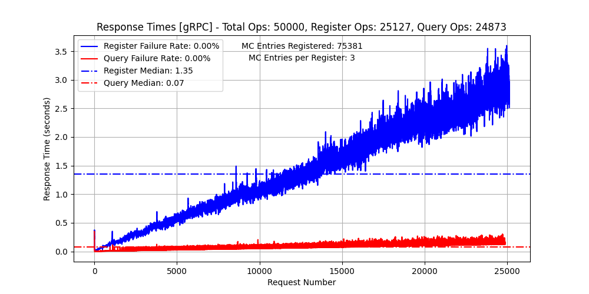

# Testing Methods for "Distributed-Mission-Control-for-LND"

## Table of Contents
1. [Introduction](#1-introduction)
2. [Automated Unit and Integration Testing](#2-automated-unit-and-integration-testing)
   1. [Definition and Importance](#21-definition-and-importance)
   2. [Tools and Frameworks Used](#22-tools-and-frameworks-used)
   3. [Test Coverage](#23-test-coverage)
   4. [Running Unit and Integration Tests](#24-running-unit-and-integration-tests)
3. [Stress Testing](#3-stress-testing)
   1. [Definition and Importance](#31-definition-and-importance)
   2. [Tools and Frameworks Used](#32-tools-and-frameworks-used)
   3. [Running Stress Tests](#33-running-stress-tests)
   4. [Stress Testing Results on 50000 Concurrent Users](#34-stress-testing-results-on-50000-concurrent-users)
4. [Acceptance Testing](#4-acceptance-testing)
5. [Summary of Results](#5-summary-of-results)

## 1. Introduction
Testing is a crucial part of the development process for the
"Distributed-Mission-Control-for-LND" project. This document outlines the
various testing methods employed to ensure the reliability, performance, and
correctness of the project. The methods include Automated Unit and Integration
Testing, Stress Testing, and Acceptance Testing. Each method is detailed below
with examples and instructions on how to run the tests.

## 2. Automated Unit and Integration Testing

### 2.1 Definition and Importance
Automated unit and integration testing involve writing test cases for individual
units of code (functions, methods) and their interactions. These tests help
catch bugs early and ensure that the components work together as expected.

### 2.2 Tools and Frameworks Used
- **Go Testing Package**: Standard library for writing and running tests in Go.
- **Testify**: A toolkit with assertion and mocking capabilities for Go.
- **GitHub Actions**: A CI/CD tool for automating workflows, including testing.

### 2.3 Test Coverage
Test coverage measures the amount of code being exercised by tests. We aim for
good coverage to ensure robustness. The `ecrpc` package is excluded from
coverage reports due to external dependencies, i.e., generated gRPC code.

The current test coverage in the code base is ~74%.

To generate the test coverage, use the following command:
```bash
go test -cover $(go list ./... | grep -v /ecrpc)
```

### 2.4 Running Unit and Integration Tests
To run the tests, execute the following command in the project root:
```bash
make test
```
Expected output includes all test results pass.

## 3. Stress Testing

### 3.1 Definition and Importance
Stress testing evaluates the system's behavior under extreme conditions,
ensuring it can handle high load and identify potential breaking points.

### 3.2 Tools and Frameworks Used
- **Python**: The programming language used for stress testing.
- **grpcio**: A Python library for gRPC, used to interact with gRPC services.
- **requests**: A simple, yet elegant HTTP library for Python, used to send HTTP
requests.
- **numpy**: A library for numerical operations, used for handling data.
- **matplotlib**: A plotting library, used for visualizing the results.
- **protobuf**: A library for protocol buffers, used in gRPC communication.
- **googleapis-common-protos**: Common protocol buffers for Google APIs.

### 3.3 Running Stress Tests
To run the stress tests, follow the instructions provided in the
[Stress Testing Distributed Mission Control EC repository](https://github.com/mohamedawnallah/Stress-Testing-Distributed-Mission-Control-EC). The repository contains all
necessary code and instructions to set up and execute the stress tests.

### 3.4 Stress Testing Results on 50000 Concurrent Users
The results of the stress test, which evaluated the system's response times
under the load of 50,000 concurrent users, are visualized in the following image:



**Observations:**

- **Query Results**:
  - The response time for query operations was within acceptable response times.
  - No failure rates were observed.

- **Register Results**:
  - Registration operations showed increasing response times due to data
  aggregation during each register request.
  - The MC Entries per Register Request is 3, which is low. It's recommended for
  clients to batch MC entries in larger numbers to improve performance.
  - No failure rates were observed, but performance degradation was noticeable
  under peak loads due to increased data retrieval for aggregation.

These observations indicate that while the system can handle a high number of
concurrent users, there are areas for optimization in registration operations
from the client side.

## 4. Acceptance Testing
TODO(mohamedawnallah): Acceptance testing is an ongoing effort. For more
details, refer to the
[Acceptance Testing Distributed Mission Control EC repository](https://github.com/mohamedawnallah/Acceptance-Testing-Distributed-Mission-Control-EC).

<!-- ##### Definition and Importance
Acceptance testing ensures the system meets the specified requirements and works
as intended from an end-user perspective.

##### Tools and Frameworks Used

##### Test Scenarios

##### Running Acceptance Tests -->

## 5. Summary of Results
- **Automated Testing**: Achieved 74% test coverage, identifying and fixing several bugs.
- **Stress Testing**: Successfully handled 50,000 concurrent users with acceptable query response times and identified areas for optimization in registration operations from the client side.
